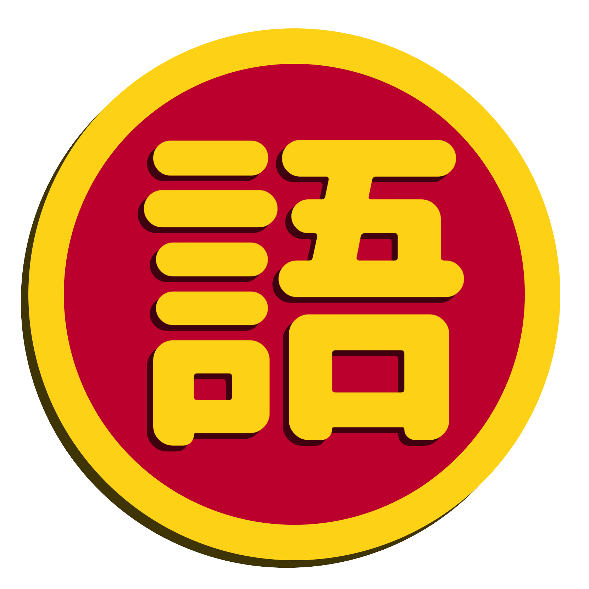

<!-- PROJECT SHIELDS -->
[![Contributors][contributors-shield]][contributors-url]
[![Forks][forks-shield]][forks-url]
[![Issues][issues-shield]][issues-url]

<!-- PROJECT LOGO -->
 

  

<h3 align="center">kanji-kei</h3>
  

    project_description
     
    <a href="https://github.com/otihianonuoyiukus/kanji-kei/issues">Report Bug</a>
    ·
    <a href="https://github.com/otihianonuoyiukus/kanji-kei/issues">Request Feature</a>
  

<!-- TABLE OF CONTENTS -->

  
Table of Contents

  <ol>
    <li>
      <a href="#about-the-project">About The Project</a>
      <ul>
        <li><a href="#built-with">Built With</a></li>
      </ul>
    </li>
    <li><a href="#contributing">Contributing</a></li>
    <li><a href="#contact">Contact</a></li>
  </ol>

<!-- ABOUT THE PROJECT -->
## About The Project

[![Product Name Screen Shot][product-screenshot]](https://example.com)

### Built With

* [![React][React.js]][React-url]
* [![Bootstrap][Bootstrap.com]][Bootstrap-url]

(<a href="#readme-top">back to top</a>)

<!-- CONTRIBUTING -->
## Contributing

Contributions are what make the open source community such an amazing place to learn, inspire, and create. Any contributions you make are **greatly appreciated**.

If you have a suggestion that would make this better, please fork the repo and create a pull request. You can also simply open an issue with the tag "enhancement".
Don't forget to give the project a star! Thanks again!

1. Fork the Project
2. Create your Feature Branch (`git checkout -b feature/AmazingFeature`)
3. Commit your Changes (`git commit -m 'Add some AmazingFeature'`)
4. Push to the Branch (`git push origin feature/AmazingFeature`)
5. Open a Pull Request

(<a href="#readme-top">back to top</a>)

<!-- CONTACT -->
## Contact

Kei - [@kamenmushi](https://twitter.com/kamenmushi) - johndennisburgos@gmail.com

Project Link: [https://github.com/otihianonuoyiukus/kanji-kei](https://github.com/otihianonuoyiukus/kanji-kei)

(<a href="#readme-top">back to top</a>)

[contributors-shield]: https://img.shields.io/github/contributors/otihianonuoyiukus/kanji-kei.svg?style=for-the-badge
[contributors-url]: https://github.com/otihianonuoyiukus/kanji-kei/graphs/contributors
[forks-shield]: https://img.shields.io/github/forks/otihianonuoyiukus/kanji-kei.svg?style=for-the-badge
[forks-url]: https://github.com/otihianonuoyiukus/kanji-kei/network/members
[issues-shield]: https://img.shields.io/github/issues/otihianonuoyiukus/kanji-kei.svg?style=for-the-badge
[issues-url]: https://github.com/otihianonuoyiukus/kanji-kei/issues
[product-screenshot]: images/screenshot.png
[React.js]: https://img.shields.io/badge/React-20232A?style=for-the-badge&logo=react&logoColor=61DAFB
[React-url]: https://reactjs.org/
[Bootstrap.com]: https://img.shields.io/badge/Bootstrap-563D7C?style=for-the-badge&logo=bootstrap&logoColor=white
[Bootstrap-url]: https://getbootstrap.com